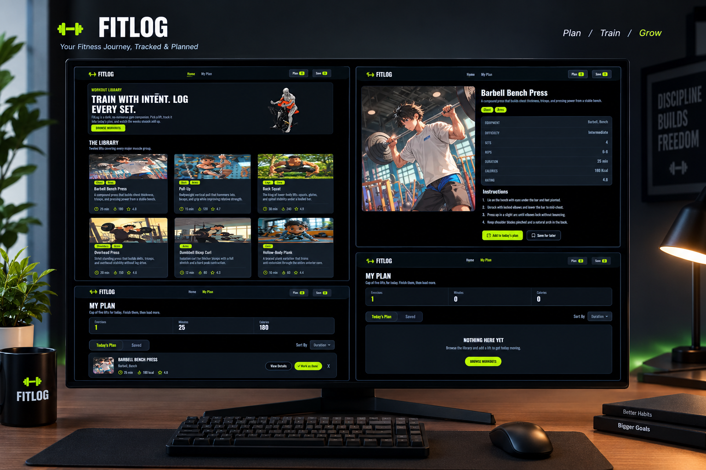

🏋️ FitLog

  
  
  
  

  <strong>A modern workout library and planning app for discovering exercises, building a daily workout plan, and tracking your training.</strong>

  <a href="https://my-fitlog-eosin.vercel.app/">🌐 Live Demo</a>

📸 Project Preview

Add your desktop screenshot here.
Save your screenshot as desktop.png inside a screenshots folder.

  

📱 Responsive Preview

You can also add your mobile screenshot here later:

screenshots/
├── desktop.png
└── mobile.png

  

✨ About The Project

FitLog is a dark-themed workout library and workout planning application built for users who want a simple way to discover exercises and organize their daily training.

Users can browse workout cards, open detailed exercise information, add workouts to Today's Plan, save exercises for later, and track basic workout statistics such as exercise count, duration, and calories.

The project follows a responsive design approach so the interface works across desktop, tablet, and mobile devices.

🚀 Live Demo

🔗 Visit FitLog Live Demo

🛠️ Technologies Used

Technology

Purpose

Next.js

Application framework and UI development

React

Building reusable UI components

TypeScript

Type-safe development

Tailwind CSS

Responsive styling and utility-first CSS

DaisyUI

Reusable UI components and styling helpers

React Toastify

Toast notifications for user actions

Lucide React

Clean and consistent interface icons

React Loading Skeleton

Loading placeholders while data is being fetched

Spinner / Loading UI

Visual feedback during loading states

⭐ Key Features

1. 🏋️ Workout Library

Browse a collection of workouts displayed in a clean responsive card layout with:

Workout image

Muscle group tags

Workout name

Equipment information

Duration

Calories

Rating

2. 📖 Workout Details

Open any workout to see detailed information including:

Exercise description

Muscle groups

Equipment

Difficulty

Sets

Reps

Duration

Calories

Rating

Step-by-step instructions

3. 📋 Today's Workout Plan

Add workouts to Today's Plan and manage your daily training list.

The plan also displays:

Total exercises

Total minutes

Total calories

Workout details

Remove action

Mark as Done action

4. 💾 Save For Later

Save workouts that you want to come back to later. The navigation counter keeps track of saved workouts.

5. 🔔 Interactive User Feedback

Important actions provide instant feedback through toast notifications, such as:

Workout added

Workout saved

Workout removed

Workout completed

6. 📊 Workout Statistics

The My Plan page dynamically displays workout statistics based on the exercises currently added to the plan.

7. 🔄 Loading & Skeleton States

Loading indicators and skeleton placeholders provide a smoother experience while workout data is being loaded.

8. 📱 Fully Responsive UI

The interface is designed to work across:

📱 Mobile

📟 Tablet

💻 Desktop

🧭 Main Pages

Page

Description

Home / Workout Library

Browse available workouts

Workout Details

View complete exercise information

My Plan

Manage today's workout and saved exercises

404 Page

Handles invalid or unknown routes

💡 How It Works

Browse Workouts
      ↓
Open Workout Details
      ↓
Add to Today's Plan / Save for Later
      ↓
Manage Your Plan
      ↓
Track Exercises, Minutes & Calories
      ↓
Mark Workout as Done

💻 Run The Project Locally

1. Clone the repository

git clone YOUR_GITHUB_REPOSITORY_URL

2. Go to the project folder

cd your-project-folder

3. Install dependencies

npm install

4. Start the development server

npm run dev

5. Open the application

Visit:

http://localhost:3000

📦 Available Scripts

# Start development server
npm run dev

# Create production build
npm run build

# Start production server
npm start

# Run lint
npm run lint

📁 Suggested Project Structure

fitlog/
├── public/
│   └── ...
├── src/
│   ├── app/
│   │   ├── page.tsx
│   │   ├── my-plan/
│   │   └── ...
│   ├── components/
│   │   └── ...
│   ├── types/
│   │   └── ...
│   └── ...
├── screenshots/
│   └── desktop.png
├── package.json
├── tsconfig.json
└── README.md

🎨 Design Highlights

Dark fitness-focused interface

High-contrast neon accent color

Clean workout cards

Responsive grid layout

Clear navigation

Detailed workout information panels

Interactive buttons and toast feedback

Skeleton loading experience

Mobile-friendly responsive layout

🌐 Deployment

The project is deployed with Vercel.

Live Website

https://my-fitlog-eosin.vercel.app/

👨‍💻 Developer

Your Name

GitHub: YOUR_GITHUB_PROFILE

Portfolio: YOUR_PORTFOLIO_URL

Email: YOUR_EMAIL

  <strong>💪 Train hard. Log honest.</strong>

  Built with Next.js, TypeScript & Tailwind CSS.

